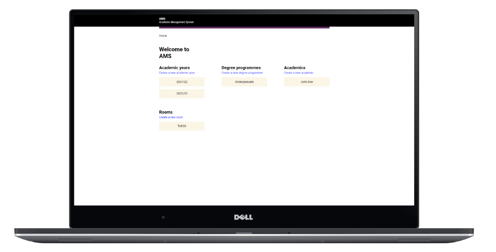
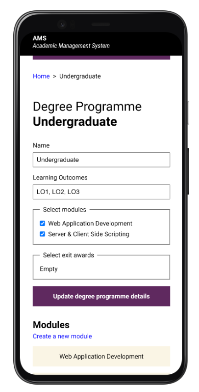

# Academic Management System (AMS)

This system is built with vanilla HTML, CSS, and JavaScript without any frameworks. It soleley relies on the `json-server` JavaScript library to mock a REST API interface, which allows for the frontend to interact with the `db.json` file.

This fork is an extension implementation part of coursework two for the CIS2169 - Web Application Development module at Edge Hill University.

## Screenshots

Mobile

 

## Running the system (setup)
The project was setup using the yarn package manager.

### Prerequisites
You will need the following before starting:
- `Node` _(>v18.0.0)_
- `Yarn` package manager

### Steps
1. Git clone the repository.
2. Go into the project root folder.
3. Run `yarn` to install dependencies.
4. Run `yarn start` to run the server and use the system.

## Documentation
You can view the documentation for the classes, which provide the interface for interacting with the database.

This is generated using [JSDoc](https://jsdoc.app/).

Generate the documentation:
1. Run `yarn docs` in the root of the repository.

This will generate a `./docs` directory and you can simply open the `./index.html` file to navigate and view.
